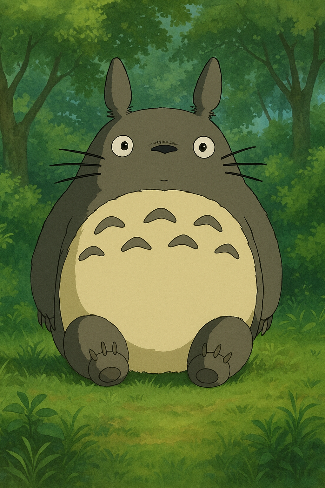
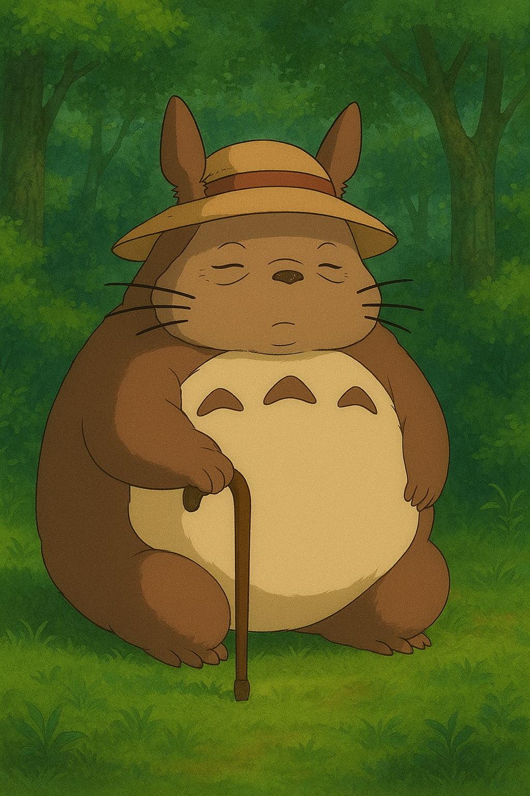

# Copyright and Content Platforms - Assignment Report

**Name:** PBortis  
**Date:** December 10, 2025  
**Platform:** YouTube
**Student ID: 12379944

---

## 1. Platform Analysis: YouTube

### Copyright Detection Mechanisms

YouTube employs a sophisticated multi-layered copyright enforcement system:

**Content ID System:**
- Automated fingerprinting technology that scans all uploaded videos against a database of copyrighted material
- Rights holders submit reference files (audio, video, or both) to create digital fingerprints
- System matches uploads in real-time or within minutes of upload
- Detects matches even with modifications (pitch changes, speed alterations, cropping, filters)

**Manual Reporting:**
- Copyright owners can manually submit DMCA takedown notices
- "Report" button available on all videos for rights holders
- Requires legal verification and penalty for false claims

**Detection Response Time:**
- Content ID typically detects matches within seconds to 10 minutes of upload
- Manual reports can take hours to days
- Some content may never be detected if not in the reference database

### Actions When Content is Flagged

YouTube provides several options depending on the rights holder's preferences:

1. **Block** - Video cannot be viewed in specified territories or worldwide
2. **Monetize** - Video stays up, but ads run and revenue goes to copyright holder
3. **Track** - Copyright holder monitors viewership statistics
4. **Mute** - Audio is removed, video remains

### Appeals and Counter-Notification Process

**For Content ID Claims:**
1. Uploader can dispute the claim directly in YouTube Studio
2. Rights holder has 30 days to respond
3. If rights holder releases claim, video is restored
4. If rights holder upholds claim or files DMCA takedown, video may be removed

**For DMCA Takedowns:**
1. Uploader can submit a counter-notification
2. Must include legal statement under penalty of perjury
3. Copyright holder has 10-14 business days to file lawsuit
4. If no lawsuit, content is restored after this period

### Monetization Policies

- Videos with copyright claims can still be published, but monetization may be disabled or redirected
- Some rights holders allow revenue sharing for certain uses
- "Made for Kids" content has different monetization rules
- Multiple copyright strikes can lead to channel termination

### Special Programs

- **Content ID Licensing Agreements**: Some music labels allow use of their content with revenue sharing
- **YouTube Audio Library**: Provides free music for creators
- **Copyright Match Tool**: Helps creators protect their own original content

### Observations from Experiments

YouTube's automated Content ID system proved highly effective, detecting copyrighted audio (Mitski) within 10 minutes. However, AI-generated visual content referencing copyrighted characters (Totoro) was not flagged, revealing a gap between copyright law (derivative works) and automated enforcement capabilities.

---

## 2. Fair Use Experiments

### Piece 1: Raw Copyrighted Content - "I Bet On Losing Dogs" (Control)

**Description:**
Uploaded the original Mitski song "I Bet On Losing Dogs" (2016) as a control experiment to establish baseline copyright detection. Video titled "IBetOnLosingDogs" featured the unmodified audio track with a static visual.

**Upload Details:**
- **Platform:** YouTube
- **Upload Date:** December 9, 2025
- **Video Length:** 12 seconds
- **Audio Modifications:** None - original song

**Timeline and Outcome:**

- **T+0 minutes:** Video uploaded successfully, began processing
- **T+3 minutes:** Video published and publicly available
- **T+8 minutes:** Copyright notification received

**Copyright Claim Details:**
- **Claimant:** Dead Oceans (Mitski's record label)
- **Claimed Content:** Sound recording "I Bet On Losing Dogs"
- **Action:** Copyright claim applied - Video remains public, but all revenue goes to claimant

**Options Presented:**
1. Accept the claim (monetization disabled/redirected)
2. Trim out claimed segment
3. Replace audio with Audio Library track
4. Mute claimed segment
5. Dispute the claim

**Decision:** Accepted the claim for experimental purposes

**Final Status:** Video remains public with copyright claim. Not blocked or removed.

### Piece 2: Transformative Edit - "I Bet On Losing Cats" (Experimental)

**Description:**
Created a transformative edit titled "IBetOnLosingCats" using Mitski's song "I Bet On Losing Dogs" where instances of the word "dogs" in the lyrics were replaced with cat meowing sounds, creating a humorous parody/commentary.

**Upload Details:**
- **Platform:** YouTube
- **Upload Date:** December 9, 2025
- **Video Length:** 12 seconds
- **Audio Modifications:** Cat meows replacing the word "dogs" in the vocals

**Timeline and Outcome:**

- **T+0 minutes:** Video uploaded successfully, began processing
- **T+3 minutes:** Video published and publicly available
- **T+24+ hours:** No copyright notification received

**Copyright Claim Details:**
- **Claimant:** None
- **Status:** No copyright claim

**Final Status:** Video remains public with no copyright restrictions. Fully monetizable (if enabled).

The screenshot above shows the YouTube Studio interface with both uploaded videos:
- **IBetOnLosingDogs** (Piece 1): Marked with "Copyright" claim from Dead Oceans, uploaded Dec 9, 2025
- **IBetOnLosingCats** (Piece 2): No copyright claim ("None"), uploaded Dec 9, 2025

**Key Findings:**
- Content ID detected the unmodified Mitski song within 8 minutes
- The transformative cat edit was not flagged by Content ID, even though it uses the same underlying musical composition
- This suggests Content ID's audio fingerprinting may struggle with certain types of vocal modifications
- The modified version remained unclaimed for over 24 hours, indicating it successfully evaded automated detection

---

## 3. AI-Generated Content Investigation

### Experiment 1: Direct Character Reference - Totoro Images

**AI Tool:** DALL-E 3 (via ChatGPT Plus)

**Prompts Used:**
1. "Create an image of Totoro"
2. "Create an image of Totoro's grandma holding a cane"

**AI Output:**
Both prompts successfully generated images featuring characters visually similar to Totoro - large, grey, rotund creatures with distinctive ears and facial features. The AI clearly understood the copyrighted character reference despite being trained to avoid reproducing copyrighted material. Images were not derivative at all.

**Upload Details:**
- **Platform:** YouTube (as video thumbnails and within 1-minute slideshow videos)
- **Upload Date:** December 9, 2025
- **Content:** Two separate short videos, each displaying one AI-generated Totoro image.

**Platform Response:**
- **Detection:** No copyright claims received
- **Status:** Both videos remain public and fully monetizable
- **Time Monitored:** 24+ hours, no flags

**Research Findings:**

**DALL-E 3 Terms of Service (OpenAI):**
- Users own the images they create, including commercial rights
- OpenAI claims no ownership of user-generated content
- However, policy prohibits "attempts to create images of public figures, copyrighted characters, or trademarked properties"
- Enforcement is inconsistent - some copyrighted character prompts are rejected, others (like Totoro) succeed

**Copyright Ownership Analysis:**
- **Legal uncertainty:** Courts have not definitively ruled on AI-generated content copyright
- **OpenAI's position:** Users own output, but this doesn't address infringement of training data sources
- **Potential claimants:** Studio Ghibli (original Totoro copyright holder), Hayao Miyazaki (creator), OpenAI (tool provider)
- **Training data issue:** If DALL-E was trained on Totoro images without permission, generates derivative works
- **Current consensus:** If AI output is too similar to copyrighted source, it may constitute infringement regardless of who "owns" the AI output

**YouTube's AI-Generated Content Policy:**
- Must disclose altered/synthetic content that could be mistaken for real people or events
- No specific policy prohibiting AI-generated content that resembles copyrighted characters
- Content ID system does not effectively detect AI-generated derivatives of copyrighted visual works
- Manual reporting by rights holders still possible

## 4. Legal Analysis

### Fair Use Four-Factor Analysis

#### Piece 1: Raw Mitski Song "I Bet On Losing Dogs" (Control)

**Factor 1: Purpose and Character of Use**
- **Assessment:** Not transformative
- **Analysis:** Direct reproduction with no added commentary, criticism, parody, or new expression. Purpose is identical to original (entertainment/listening to the song). This is simply making the copyrighted work available for consumption.
- **Commercial nature:** Non-commercial personal upload, though YouTube is a commercial platform
- **Favors:** Strongly favors copyright holder

**Factor 2: Nature of the Copyrighted Work**
- **Assessment:** Highly creative work
- **Analysis:** "I Bet On Losing Dogs" is a creative, published musical composition and sound recording. Music receives strong copyright protection as highly creative expression (as opposed to factual works which receive less protection).
- **Favors:** Strongly favors copyright holder

**Factor 3: Amount and Substantiality Used**
- **Assessment:** Used entire work (12-second clip represents full excerpt uploaded)
- **Analysis:** The clip includes recognizable portions of the song, capturing the "heart of the work" with the melody, vocals, and emotional core intact. Even short excerpts can be substantial if they contain the most memorable or distinctive parts.
- **Favors:** Strongly favors copyright holder

**Factor 4: Effect on Market**
- **Assessment:** Direct market substitution
- **Analysis:** Unmodified clips directly compete with official releases on streaming platforms and YouTube. Users could listen to this instead of the official version, causing direct market harm by substituting for the original.
- **Favors:** Strongly favors copyright holder

**Overall Fair Use Conclusion:**
Clearly not fair use. This represents the paradigm case of copyright infringement - direct reproduction with no transformative purpose, substantial use of highly creative work, and direct market competition. The automatic Content ID claim within 8 minutes reflects this legal reality. All four factors weigh heavily in favor of the copyright holder.

#### Piece 2: "I Bet On Losing Cats" - Transformative Cat Edit

**Factor 1: Purpose and Character of Use**
- **Assessment:** Moderately transformative
- **Analysis:** The video adds new expression by replacing the word "dogs" with cat meows, creating humorous commentary and parody. This could be viewed as satirizing the song's serious treatment of devotion by applying it to the stereotypically independent nature of cats, or as general internet humor culture. However, the original song remains recognizable and still serves primarily entertainment purposes similar to the original.
- **Commercial nature:** Non-commercial personal upload
- **Transformative elements:** Audio substitution creates new meaning/expression
- **Favors:** Moderately favors fair use due to transformative/parodic elements, but weakened by entertainment purpose

**Factor 2: Nature of the Copyrighted Work**
- **Assessment:** Highly creative work
- **Analysis:** Same as Piece 1 - "I Bet On Losing Dogs" is creative musical expression entitled to strong copyright protection.
- **Favors:** Strongly favors copyright holder

**Factor 3: Amount and Substantiality Used**
- **Assessment:** Used substantial portion of underlying work
- **Analysis:** While the vocal lyrics were modified with cat sounds, the underlying musical composition (melody, instrumentation, arrangement) remains intact and recognizable. The 12-second clip still captures the essential character of the song. The modification is superficial rather than fundamental.
- **Favors:** Favors copyright holder (though slightly less strongly than Piece 1 due to modifications)

**Factor 4: Effect on Market**
- **Assessment:** Minimal direct market harm
- **Analysis:** A version with cat meows is unlikely to substitute for the original song - listeners seeking Mitski's actual performance would not be satisfied by this edit. It might even serve as promotion, exposing new audiences to the original. However, it could potentially appear in search results for the original song. The humorous nature makes market substitution unlikely.
- **Favors:** Moderately favors fair use

**Overall Fair Use Conclusion:**
Mixed outcome - likely marginal fair use case. The transformative/parodic nature (Factor 1) and minimal market impact (Factor 4) support fair use, while the creative nature of the work (Factor 2) and substantial use of the composition (Factor 3) weigh against it. A court would likely focus on whether the modification is sufficiently transformative to constitute parody or whether it merely uses the copyrighted work for comedic purposes without commenting on the original. 

**Interesting Technical Finding:** Despite legal ambiguity, Content ID did NOT detect this version, suggesting that the vocal modifications were sufficient to evade audio fingerprinting, even though the underlying composition infringement likely remains. This reveals a gap between legal liability and technical enforcement.

**Comparison of the Two Pieces:**
The side-by-side comparison demonstrates that:
1. Content ID is highly effective at detecting unmodified copyrighted audio
2. Even minor audio modifications can evade fingerprint detection
3. Evading detection does NOT equal legal fair use - the "cats" version likely still infringes despite avoiding automated claims
4. Platform enforcement and legal rights are separate issues

### AI-Generated Content Legal Analysis

#### Experiment 1: Totoro Character Images

**Copyright Infringement Analysis:**

**Derivative Work Issue:**
- AI-generated images that closely resemble Totoro likely constitute unauthorized derivative works under 17 U.S.C. § 106(2)
- Studio Ghibli holds exclusive right to create derivatives of Totoro character
- Visual similarity and recognizability suggests infringement despite AI generation method

**Fair Use Defense:**
Testing fair use factors:
1. **Purpose:** Not transformative - recreates character for similar aesthetic/entertainment purpose
2. **Nature:** Totoro is highly creative fictional character (strong protection)
3. **Amount:** Reproduces essential character elements (body shape, facial features, color scheme)
4. **Market Effect:** Could substitute for official Totoro merchandise/imagery

**Conclusion:** Likely infringement, weak fair use defense

**Ownership Questions:**
- **Who owns AI output?** OpenAI grants ownership to users, but this doesn't resolve underlying infringement
- **Who is liable?** Potentially both the AI user (me) and possibly OpenAI for facilitating infringement
- **Complication:** If AI learned from copyrighted Totoro images without license, both training and generation may involve infringement

**Why No Platform Detection?**
- YouTube's Content ID primarily matches audio and video fingerprints
- Static images harder to match than audio/video
- AI-generated variations differ enough from reference files to evade detection
- Manual reporting would be required for enforcement

**Note on "Totoro's Grandma" Image:**
The second AI-generated image (ForestCreatureGrandma.png) demonstrates how AI tools can create derivative characters based on copyrighted sources. The prompt "Totoro's grandma" produced a creature sharing Totoro's distinctive visual characteristics (large ears, rotund body, grey coloring) but in a modified form. This illustrates how AI can generate variations that maintain the essence of copyrighted characters while evading both automated detection and potentially some legal boundaries.

---

## 4. Legal Analysis (continued)

### Gap Analysis: Law vs. Policy vs. Enforcement

#### Gap 1: AI Derivative Works

**Legal Theory:**
- Copyright law prohibits unauthorized derivative works
- AI-generated content closely resembling copyrighted characters should constitute infringement
- Rights holders have legal recourse under existing copyright statute

**Platform Policy:**
- YouTube's stated policy prohibits copyright infringement, including derivatives
- Users must own rights or have permission for all content
- Content ID system promises to detect copyrighted material

**Actual Enforcement:**
- Content ID failed to detect AI-generated Totoro images
- Derivative visual works evade automated detection
- Manual reporting required, but rights holders may not monitor for AI-generated content

**Gap Explanation:**
Enforcement technology lags behind AI generation capabilities. Content ID excels at matching audio/video fingerprints but struggles with AI-generated variations of visual content. This creates a practical safe harbor for AI-generated infringement despite no legal protection.

#### Gap 2: Transformative Use Threshold

**Legal Theory:**
- Fair use depends on case-by-case analysis of four factors
- Courts increasingly favor transformative uses (*Campbell v. Acuff-Rose*, *Cariou v. Prince*)
- Adding creative elements or new purpose can support fair use

**Platform Policy:**
- YouTube's policy acknowledges fair use exists
- Encourages users to dispute claims if they believe use is fair
- However, provides tools for rights holders to claim/monetize rather than evaluate fair use

**Actual Enforcement:**
- Content ID automatically claims/blocks without fair use analysis for unmodified content
- The original Mitski song was claimed immediately, but the cat edit evaded detection entirely
- This suggests Content ID uses audio fingerprinting that can be bypassed with vocal modifications
- No algorithmic assessment of whether evasion equals legal fair use

**Gap Explanation:**
Automated systems cannot perform nuanced fair use analysis requiring human judgment. Interestingly, they also cannot detect all infringements - the cat edit evaded detection despite potentially still infringing the underlying composition. This creates two problems: (1) legitimate fair uses may be overclaimed, and (2) infringing content that evades fingerprinting goes unclaimed, creating inconsistent enforcement based on technical detection rather than legal merits.

#### Gap 3: Short Clip "Safe Harbors"

**Legal Theory:**
- No statutory duration exemption for copyrighted clips
- Even short excerpts can infringe if they capture "heart of the work"
- De minimis use defense exists but narrowly applied

**Platform Folklore:**
- Widespread belief that clips under 10-15 seconds are "safe" from copyright claims
- Users often claim "fair use" for any short clip

**Actual Enforcement:**
- Content ID detected 12-second unmodified Mitski clip within 8 minutes
- No duration threshold prevents detection of unmodified content
- However, the same 12-second clip with cat meow modifications completely evaded detection
- Rights holders can claim clips of any length, but only if Content ID's fingerprinting detects them

**Gap Explanation:**
User misconceptions about copyright law create false sense of security. Many believe short clips are "safe," but the reality is more nuanced: short unmodified clips are detected immediately, while modified clips may evade detection regardless of length. This isn't a legal safe harbor - it's a technical limitation. Platform interfaces don't clearly explain that evading detection doesn't equal legal protection.

#### Gap 4: Rights Holder Discretion

**Legal Theory:**
- Copyright holders must choose between claiming infringement or allowing use
- Fair use is an affirmative defense users can raise
- DMCA requires good faith belief in infringement

**Platform Policy:**
- Content ID gives rights holders three options: block, monetize, or track
- Presents choice as rights holder preference rather than legal determination

**Actual Enforcement:**
- The unmodified 12-second Mitski clip was claimed and monetized by Dead Oceans
- The cat-modified 12-second clip was not detected at all
- Both pieces likely have similar legal status (potential infringement), but vastly different platform outcomes
- Outcome depends on whether Content ID's fingerprinting detects the content, not on legal merit

**Gap Explanation:**
Platform architecture creates a binary outcome based on technical detection: content is either automatically claimed (if detected) or completely ignored (if not detected). This has no correlation with legal fair use analysis. Users may incorrectly believe that content which evades detection is legally permissible, when in reality it simply bypassed the automated system. The platform treats copyright enforcement as a technical matching problem rather than a legal determination.

### Conclusions

These experiments revealed significant gaps between copyright law as written, platform policies as stated, and enforcement as practiced:

1. **Audio vs. Visual Detection Asymmetry:** Copyright law protects audio and visual works equally, but YouTube's Content ID is vastly more effective at detecting audio infringement. AI-generated visual derivatives escape enforcement despite likely being illegal.

2. **Automation vs. Nuance:** Fair use requires case-by-case analysis impossible for algorithms. Automated enforcement creates de facto stricter rules than legal fair use would allow, but users can dispute (few do).

3. **Rights Holder Power:** Platforms empower rights holders to make enforcement decisions (block vs. monetize) that don't correlate with legal distinctions. Same infringement can have different outcomes based on holder preferences.

4. **Educational Deficit:** Platform interfaces don't adequately explain copyright law, leading to user misconceptions (duration myths, AI ownership confusion, fair use misunderstanding).

These gaps suggest that copyright's actual operation on modern platforms diverges significantly from legislative intent, raising questions about whether law, platforms, or both require reform.

---

## 5. Appendix

### Screenshot Inventory

1. `screenshots/task2copyright.png` - YouTube Studio showing copyright status for both videos (IBetOnLosingDogs with copyright claim, IBetOnLosingCats with no claim)
2. `screenshots/Totoro.png` - AI-generated Totoro character image
3. `screenshots/ForestCreatureGrandma.png` - AI-generated Totoro's grandma character image

### Links to Uploaded Content

**Fair Use Experiments:**
1. IBetOnLosingDogs (Original Mitski song) - [https://www.youtube.com/watch?v=2Zt4gARHVTk&feature=youtu.be] (Public, copyright claimed by Dead Oceans)
2. IBetOnLosingCats (Cat meow edit) - [https://www.youtube.com/watch?v=Z6DFY4CyM74&feature=youtu.be] (Public, no copyright claim)

**AI-Generated Content:**
1. AI Totoro - [https://www.youtube.com/watch?v=HSZJeFZrAbg&feature=youtu.be] (Public, no claims)
2. AI Totoro Grandma - [https://www.youtube.com/watch?v=ecHDg4V_ctY&feature=youtu.be] (Public, no claims)